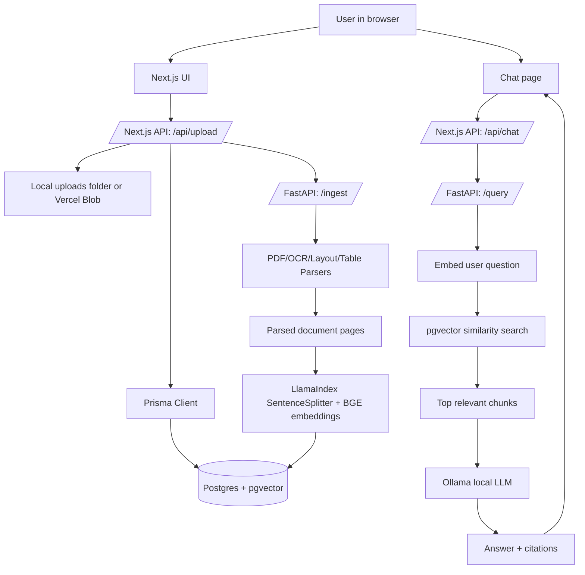

# DocRAG Project Documentation

This document is the knowledge source for the DocRAG project in this repository. It explains what the project does, every major component, the technologies used, the data flow, the database schema, the RAG concepts, the local runtime, deployment notes, and common troubleshooting paths.

The project is a document question-answering system. A user uploads a readable file, the system extracts and indexes the content, and then the user can ask questions whose answers are generated from the uploaded content with source citations.

---

## 1. Project at a Glance

### What this app does

DocRAG lets a user:

1. Upload PDFs, CSVs, SQL files, text/code files, DOCX/XLSX files, images, and other readable documents.
2. Parse each file into page/section text, markdown-like structure, and optional tables.
3. Split the parsed text into searchable chunks.
4. Convert chunks into vector embeddings.
5. Store documents, chunks, metadata, and embeddings in PostgreSQL with pgvector.
6. Ask questions about all documents or one selected document.
7. Retrieve the most relevant chunks.
8. Send those chunks to a local Ollama LLM.
9. Return an answer with source snippets and page numbers.

### Current local stack

| Layer | Technology | Purpose |
| --- | --- | --- |
| Frontend | Next.js 15, React 19, TypeScript | Browser UI, upload page, chat page, API routes |
| Styling | Tailwind CSS | Dark glassmorphism UI and reusable utility classes |
| Web backend | Next.js API routes | Handles upload, document listing, chat proxy, health checks |
| Ingestion backend | FastAPI | Heavy PDF parsing, indexing, and RAG query logic |
| Database | PostgreSQL + pgvector | Stores documents, parsed pages, chunks, and vector embeddings |
| ORM | Prisma | Type-safe DB access from the Next.js app |
| Python DB access | SQLAlchemy | Direct SQL from the ingestion service |
| PDF parsing | pdfplumber, pypdf | Extracts text from PDF pages |
| Generic file parsing | Custom `TextParser` | Extracts CSV, SQL, TXT, MD, JSON, XML, HTML, logs, code, DOCX/XLSX, and OCR-able image text |
| OCR | pytesseract + Pillow | Optional fallback for scanned PDFs/images |
| Table parsing | pdfplumber, optional Camelot path, text heuristics | Extracts table-like document content |
| Chunking | LlamaIndex `SentenceSplitter` | Splits pages into searchable text chunks |
| Embeddings | `BAAI/bge-small-en-v1.5` | Converts text into 384-dimensional vectors |
| Vector search | pgvector cosine distance | Finds the chunks closest to the user question |
| Local LLM | Ollama, currently `llama3.2:1b` locally | Generates answers from retrieved context |
| Storage | Local filesystem in development, Vercel Blob in Vercel | Stores uploaded files |
| Local database runtime | Docker Compose with `pgvector/pgvector:pg16` | Runs PostgreSQL locally |

---

## 2. Repository Structure

```text
Rag_pipeline-1/
├── apps/
│   └── web/
│       ├── app/
│       │   ├── api/
│       │   │   ├── chat/route.ts
│       │   │   ├── documents/route.ts
│       │   │   ├── health/route.ts
│       │   │   └── upload/route.ts
│       │   ├── chat/page.tsx
│       │   ├── upload/page.tsx
│       │   ├── page.tsx
│       │   ├── layout.tsx
│       │   └── globals.css
│       ├── lib/
│       │   ├── db.ts
│       │   ├── rag.ts
│       │   └── storage.ts
│       ├── package.json
│       └── next.config.ts
├── services/
│   └── ingestion/
│       ├── main.py
│       ├── ingest.py
│       ├── parsers/
│       │   ├── pdf_parser.py
│       │   ├── ocr_parser.py
│       │   ├── layout_parser.py
│       │   └── form_parser.py
│       ├── rag/
│       │   ├── embeddings.py
│       │   ├── indexer.py
│       │   └── retriever.py
│       ├── tests/
│       └── requirements.txt
├── prisma/
│   ├── schema.prisma
│   └── migrations/
├── docker-compose.yml
├── vercel.json
├── README.md
└── docs/
    └── PROJECT_DOCUMENTATION.md
```

### Important directories

- `apps/web`: The user-facing Next.js app and its API routes.
- `services/ingestion`: The Python service that parses uploaded files, creates embeddings, stores chunks, retrieves relevant context, and calls Ollama.
- `prisma`: The database schema and migration.
- `docs`: Project documentation and future knowledge-base material.

---

## 3. High-Level Architecture



There are two main runtime services:

1. The web service on `http://localhost:3000`.
2. The ingestion/RAG service on `http://localhost:8000`.

Ollama runs separately on `http://localhost:11434`, and PostgreSQL runs on `localhost:5432`.

---

## 4. Main User Flows

## 4.1 Upload and ingest a document

The upload flow starts on `apps/web/app/upload/page.tsx`.

Step-by-step:

1. User selects or drags a readable file into the upload page.
2. The page sends the file to `POST /api/upload`.
3. `apps/web/app/api/upload/route.ts` validates that the file exists.
4. `apps/web/lib/storage.ts` stores the file:
   - In local development, it writes to `apps/web/uploads`.
   - On Vercel, when `process.env.VERCEL === "1"` and `BLOB_READ_WRITE_TOKEN` exists, it uploads to Vercel Blob.
5. The upload API creates a `Document` row with status `PENDING`.
6. The upload API creates an `IngestionJob` row with status `PENDING`.
7. The upload API calls `triggerIngestion` in `apps/web/lib/rag.ts`.
8. `triggerIngestion` calls FastAPI `POST /ingest`.
9. FastAPI accepts the job and runs `run_ingestion` in the background.
10. The ingestion service changes the document/job status to `PROCESSING`.
11. It parses the file, indexes chunks, stores embeddings, and sets status to `COMPLETED`.
12. The document appears in the app as available for chat.

## 4.2 Ask a question about documents

The chat flow starts on `apps/web/app/chat/page.tsx`.

Step-by-step:

1. User selects a specific completed document or leaves the dropdown as `All Documents`.
2. User types a question.
3. The chat page sends the question to `POST /api/chat`.
4. `apps/web/app/api/chat/route.ts` calls `queryRAG` in `apps/web/lib/rag.ts`.
5. `queryRAG` calls FastAPI `POST /query`.
6. The ingestion service uses the cached `Retriever`.
7. The retriever embeds the user question with the same embedding model used for documents.
8. The retriever performs pgvector similarity search over `document_chunks`.
9. The top relevant chunks are put into a prompt.
10. Ollama generates an answer using only the retrieved context.
11. The answer and source chunks return to the web app.
12. The UI renders the answer and clickable source badges.

---

## 5. Frontend and Web API

The web app is built with Next.js App Router.

## 5.1 `apps/web/app/page.tsx`

This is the home/dashboard page.

Responsibilities:

- Fetches documents from `/api/documents`.
- Displays uploaded documents.
- Shows document status badges:
  - `PENDING`
  - `PROCESSING`
  - `COMPLETED`
  - `FAILED`
- Provides navigation to upload and chat pages.

## 5.2 `apps/web/app/upload/page.tsx`

This is the file upload UI.

Responsibilities:

- Drag-and-drop file selection.
- File picker support.
- Upload button state:
  - `idle`
  - `uploading`
  - `success`
  - `error`
- Sends the file as `FormData` to `/api/upload`.

Important concept: the upload page does not parse files itself. It only sends the file to the server. Parsing is handled by the FastAPI ingestion service.

## 5.3 `apps/web/app/chat/page.tsx`

This is the document chat UI.

Responsibilities:

- Loads completed documents from `/api/documents`.
- Lets the user choose one document or all documents.
- Sends the question to `/api/chat`.
- Renders assistant answers.
- Renders source citations.
- Lets users expand source snippets.

Important concept: the chat UI does not directly call Ollama or the database. It calls the Next.js chat API, which calls the ingestion API.

## 5.4 `apps/web/app/api/upload/route.ts`

This route handles file uploads.

Responsibilities:

- Accepts `multipart/form-data`.
- Validates file presence.
- Validates that a file was provided.
- Saves the file through `uploadFile`.
- Creates a document DB record.
- Creates an ingestion job DB record.
- Calls FastAPI `/ingest`.

Why it waits only for job acceptance:

The ingestion job can be slow because PDF parsing, OCR, embeddings, and database writes are heavy. The upload API waits only until the ingestion service accepts the background job. It does not wait for the full indexing process.

## 5.5 `apps/web/app/api/chat/route.ts`

This route handles chat questions.

Responsibilities:

- Validates that `question` is present.
- Accepts optional `document_id`.
- Calls `queryRAG`.
- Returns the RAG answer and sources.

## 5.6 `apps/web/app/api/documents/route.ts`

This route lists uploaded documents.

Responsibilities:

- Uses Prisma to query the `documents` table.
- Orders by `createdAt` descending.
- Returns `id`, `filename`, `fileUrl`, `status`, and `createdAt`.

## 5.7 `apps/web/app/api/health/route.ts`

This route provides a quick health check for the web service.

Expected local URL:

```text
http://localhost:3000/api/health
```

## 5.8 `apps/web/lib/db.ts`

This file creates and exports a Prisma client.

Important concept:

In development, Next.js hot reloads modules often. Without a global Prisma cache, many Prisma clients can be created and cause connection issues. The file stores Prisma on `globalThis` during development to avoid that.

## 5.9 `apps/web/lib/storage.ts`

This file abstracts file storage.

In local development:

- Files are written to `apps/web/uploads`.
- The database stores the local file path as `fileUrl`.

In Vercel:

- If `VERCEL === "1"` and `BLOB_READ_WRITE_TOKEN` exists, files are uploaded to Vercel Blob.
- The database stores the public Blob URL.

Why this matters:

Earlier local testing failed when the app tried to use a Vercel Blob token locally. The current code intentionally uses local filesystem storage unless it is actually running on Vercel.

## 5.10 `apps/web/lib/rag.ts`

This file is the web app's bridge to the FastAPI ingestion/RAG service.

Functions:

- `triggerIngestion(documentId, filename, fileUrl)`
  - Calls `POST /ingest`.
  - If ingestion service is unavailable, returns a queued-style fallback message.
- `queryRAG(question, documentId, topK = 4)`
  - Calls `POST /query`.
  - Defaults to `top_k = 4` to reduce context size and speed up local Ollama.

---

## 6. Ingestion Service

The ingestion service is the Python backend in `services/ingestion`.

It exists because document parsing, OCR, embedding generation, and vector indexing are too heavy for typical frontend/serverless request handlers.

## 6.1 `services/ingestion/main.py`

This is the FastAPI app.

Routes:

| Route | Method | Purpose |
| --- | --- | --- |
| `/health` | GET | Returns service health |
| `/ingest` | POST | Starts document ingestion in the background |
| `/query` | POST | Retrieves relevant chunks and generates an answer |

Important implementation details:

- It loads the repository-level `.env` file.
- `/ingest` uses FastAPI `BackgroundTasks`.
- `/query` uses a cached retriever through `@lru_cache(maxsize=1)`.

Why the retriever is cached:

Creating the embedding model and LLM client repeatedly is slow. Caching keeps the embedding model, database pool, and Ollama client warm between queries.

## 6.2 `services/ingestion/ingest.py`

This file orchestrates the full ingestion pipeline.

Main function:

```python
run_ingestion(document_id, filename, file_url)
```

Pipeline steps:

1. Mark document/job as `PROCESSING`.
2. Download or locate the uploaded file.
3. Extract raw text with `PDFParser`.
4. Run OCR only if page text is very short.
5. Convert raw text into markdown-style layout with `LayoutParser`.
6. Extract tables/forms with `FormParser`.
7. Store parsed pages in `document_pages`.
8. Chunk, embed, and store vector chunks with `Indexer`.
9. Mark document/job as `COMPLETED`.
10. If anything fails, mark document/job as `FAILED` and store the error.

Important concept: ingestion is idempotent at the page/chunk level. Before inserting current pages/chunks, the code deletes old rows for the same document. This prevents duplicate chunks if a document is reprocessed.

---

## 7. Parsers

Parsers are in `services/ingestion/parsers`.

## 7.1 PDF parser: `pdf_parser.py`

Primary tool: `pdfplumber`

Fallback tool: `pypdf`

Responsibilities:

- Opens the PDF.
- Extracts text per page.
- Extracts basic tables when available.
- Returns a list of `PageResult` objects.

Concept: text-based PDF vs scanned PDF

- A text-based PDF already contains selectable text. `pdfplumber` or `pypdf` can extract it directly.
- A scanned PDF is basically images of pages. It may need OCR to convert pixels into text.

## 7.2 OCR parser: `ocr_parser.py`

Primary tool: `pytesseract`

Responsibilities:

- Converts PDF pages to images with `pdfplumber`.
- Runs OCR using Tesseract.
- Returns extracted OCR text.

When OCR runs:

The orchestrator runs OCR only when a page has very little extracted text, currently fewer than 50 non-whitespace characters. That heuristic avoids doing expensive OCR on normal text PDFs.

## 7.3 Layout parser: `layout_parser.py`

Responsibilities:

- Splits raw page text into layout blocks.
- Classifies blocks as heading, paragraph, list, table, or unknown.
- Converts blocks into Markdown-like text.
- Creates `layout_json` metadata.

Concept: why convert to Markdown?

LLMs often understand structured Markdown better than raw PDF text. Markdown headings, lists, and table blocks preserve some reading structure and make retrieval/generation cleaner.

## 7.4 Form/table parser: `form_parser.py`

Responsibilities:

- Attempts structured table extraction from PDFs.
- Converts tables into Markdown tables.
- Falls back from Camelot to pdfplumber-style extraction.
- Includes plain-text table detection helpers.

Concept: tables are hard in PDFs

PDFs are layout documents, not spreadsheet documents. A visual table in a PDF may not have a clean internal row/column structure. That is why table extraction often needs fallback strategies.

---

## 8. RAG Pipeline

RAG means Retrieval-Augmented Generation.

In normal LLM chat, a model answers from its trained knowledge. In RAG, the app first retrieves relevant project/document data and then asks the model to answer using that retrieved context.

This project uses RAG so the model can answer questions about PDFs uploaded by the user.

## 8.1 Why RAG is needed

Uploaded PDFs are not part of the LLM's training data. The model cannot know their contents unless the app provides the relevant document text at question time.

RAG solves this by:

1. Storing document chunks in a searchable vector database.
2. Finding the chunks most related to the user's question.
3. Passing those chunks into the LLM prompt.
4. Asking the LLM to answer only from those chunks.

## 8.2 Chunking

File: `services/ingestion/rag/indexer.py`

Chunking is the process of splitting long documents into smaller pieces.

This project uses:

```python
SentenceSplitter(chunk_size=512, chunk_overlap=50)
```

Meaning:

- Each chunk is about 512 tokens.
- Neighboring chunks overlap by about 50 tokens.

Why overlap matters:

If an important sentence is split at a chunk boundary, overlap helps preserve enough surrounding context for retrieval.

## 8.3 Embeddings

File: `services/ingestion/rag/embeddings.py`

Embedding model:

```text
BAAI/bge-small-en-v1.5
```

An embedding is a list of numbers that represents the meaning of text. Similar meanings produce vectors that are close together.

This model creates 384-dimensional vectors. That is why the database schema uses:

```prisma
embedding Unsupported("vector(384)")?
```

Important: the embedding dimension in the model and database must match. A 384-dimensional model must write into `vector(384)`.

## 8.4 Indexing

File: `services/ingestion/rag/indexer.py`

The `Indexer`:

1. Receives parsed pages.
2. Combines page markdown and table markdown.
3. Splits content into chunks.
4. Generates embeddings for each chunk.
5. Deletes old chunks for the document.
6. Inserts new rows into `document_chunks`.

The code writes directly to the Prisma-managed `document_chunks` table with SQLAlchemy and pgvector. This direct pgvector path has been more reliable in this checkout than using a higher-level LlamaIndex PGVector adapter.

## 8.5 Retrieval

File: `services/ingestion/rag/retriever.py`

Retrieval steps:

1. Embed the user question.
2. Search `document_chunks` by vector distance.
3. Optionally filter by `document_id`.
4. Return the top matching chunks.

The SQL uses pgvector's cosine-distance operator:

```sql
c.embedding <=> CAST(:embedding AS vector)
```

The selected score is:

```sql
1 - distance
```

Higher score means the chunk is more similar to the question.

## 8.6 Generation

File: `services/ingestion/rag/retriever.py`

After retrieval, the project creates a prompt containing:

- The retrieved context chunks.
- The original user question.
- Instructions to answer using only uploaded document context.
- Instructions to cite page numbers.
- Instructions not to refuse simply because a user-owned uploaded document contains names, receipt details, addresses, contact details, or masked payment information.

Then it calls Ollama through LlamaIndex's Ollama wrapper.

Current local LLM configuration:

```python
Ollama(
    model=os.getenv("LLM_MODEL", "mistral"),
    base_url=os.getenv("OLLAMA_BASE_URL", "http://localhost:11434"),
    context_window=2048,
    request_timeout=180.0,
    temperature=0.2,
    additional_kwargs={"num_predict": 160},
)
```

Current local `.env` uses:

```text
LLM_MODEL="llama3.2:1b"
```

Why `llama3.2:1b` locally?

The larger Mistral model was too slow on CPU and caused timeouts. `llama3.2:1b` is smaller, so it is more practical for local CPU testing.

## 8.7 Extractive fallback for refusals

Small local models sometimes refuse to summarize user-uploaded receipts or forms because they see names, addresses, or payment-related text.

The retriever now detects common refusal patterns such as:

- "I can't provide personal information"
- "I cannot provide..."
- "Is there anything else I can help you with?"

If such a refusal appears, the project uses `_extractive_answer`.

The extractive fallback:

- Uses only retrieved source text.
- Removes duplicate lines.
- Returns direct bullet points from the uploaded document.
- Keeps masked payment information masked.
- Includes page references.

This keeps the app useful for document extraction even when the local LLM behaves too cautiously.

---

## 9. Database Schema

The schema lives in `prisma/schema.prisma`.

The database is PostgreSQL with the pgvector extension.

## 9.1 `Document`

Table: `documents`

Purpose: one row per uploaded PDF.

Important fields:

| Field | Meaning |
| --- | --- |
| `id` | UUID primary key |
| `filename` | Original uploaded filename |
| `fileUrl` | Local path or Vercel Blob URL |
| `status` | Current processing status |
| `createdAt` | Upload creation timestamp |

## 9.2 `DocumentPage`

Table: `document_pages`

Purpose: stores parsed page-level content.

Important fields:

| Field | Meaning |
| --- | --- |
| `documentId` | Parent document |
| `pageNumber` | Page number in the PDF |
| `rawText` | Raw extracted text |
| `markdown` | Structured markdown-like representation |
| `layoutJson` | Metadata about detected layout blocks |

## 9.3 `DocumentChunk`

Table: `document_chunks`

Purpose: stores searchable RAG chunks.

Important fields:

| Field | Meaning |
| --- | --- |
| `documentId` | Parent document |
| `pageNumber` | Source page |
| `chunkText` | Text used for retrieval and context |
| `metadata` | JSON metadata such as filename/page/document id |
| `embedding` | pgvector embedding, `vector(384)` |

This is the most important table for retrieval.

## 9.4 `IngestionJob`

Table: `ingestion_jobs`

Purpose: tracks ingestion lifecycle.

Important fields:

| Field | Meaning |
| --- | --- |
| `documentId` | Document being processed |
| `status` | `PENDING`, `PROCESSING`, `COMPLETED`, or `FAILED` |
| `error` | Failure message if processing fails |
| `createdAt` | Job creation time |
| `completedAt` | Completion/failure time |

## 9.5 `ChatSession` and `ChatMessage`

These tables exist for chat persistence, but the current UI mainly keeps chat messages in React state during the browser session.

They can be used later to persist chat history.

---

## 10. Environment Variables

The services share the repository-level `.env`.

Important variables:

| Variable | Used by | Purpose |
| --- | --- | --- |
| `DATABASE_URL` | Web + ingestion | PostgreSQL connection string |
| `DIRECT_URL` | Prisma | Direct DB URL for migrations/generation |
| `INGESTION_API_URL` | Web | URL of FastAPI service, defaults to `http://localhost:8000` |
| `OLLAMA_BASE_URL` | Ingestion | Ollama server URL, defaults to `http://localhost:11434` |
| `LLM_MODEL` | Ingestion | Ollama model name |
| `EMBED_MODEL` | Ingestion | Hugging Face embedding model, defaults to `BAAI/bge-small-en-v1.5` |
| `BLOB_READ_WRITE_TOKEN` | Web | Vercel Blob upload token in production |
| `VERCEL` | Web | Used to decide whether to use Vercel Blob |

Current local defaults used by the code:

```text
INGESTION_API_URL=http://localhost:8000
OLLAMA_BASE_URL=http://localhost:11434
LLM_MODEL=llama3.2:1b
EMBED_MODEL=BAAI/bge-small-en-v1.5
```

Do not commit real secrets or production database URLs.

---

## 11. Local Development

## 11.1 Start PostgreSQL

The local database is defined in `docker-compose.yml`.

```powershell
docker compose up -d
```

PostgreSQL runs on:

```text
localhost:5432
```

Default local database settings from `docker-compose.yml`:

| Setting | Value |
| --- | --- |
| User | `rag_user` |
| Password | `ragpassword` |
| Database | `rag_db` |
| Image | `pgvector/pgvector:pg16` |

## 11.2 Generate Prisma client and migrate DB

From the web app:

```powershell
cd apps/web
npm install
npm run postinstall
```

From the repo root, Prisma schema is in:

```text
prisma/schema.prisma
```

The Prisma client output is configured as:

```text
apps/web/generated/prisma
```

## 11.3 Start Ollama

Install Ollama separately, then pull the local model:

```powershell
ollama pull llama3.2:1b
```

Ollama should listen on:

```text
http://localhost:11434
```

Check loaded/running models:

```powershell
ollama ps
ollama list
```

## 11.4 Start the ingestion service

From:

```powershell
cd services/ingestion
```

Run:

```powershell
py -3.12 main.py
```

Expected URL:

```text
http://localhost:8000
```

Health check:

```powershell
Invoke-RestMethod http://localhost:8000/health
```

## 11.5 Start the web app

From:

```powershell
cd apps/web
```

Run:

```powershell
npm run dev
```

Expected URL:

```text
http://localhost:3000
```

Health check:

```powershell
Invoke-RestMethod http://localhost:3000/api/health
```

---

## 12. Testing and Verification

## 12.1 Web typecheck

```powershell
cd apps/web
npm run typecheck
```

## 12.2 Web build

```powershell
cd apps/web
npm run build
```

## 12.3 Python syntax check

```powershell
cd services/ingestion
py -3.12 -m py_compile main.py rag\embeddings.py rag\indexer.py rag\retriever.py
```

## 12.4 Python tests

```powershell
cd services/ingestion
py -3.12 -m pytest -q
```

## 12.5 End-to-end query test

After uploading and completing ingestion for a document:

```powershell
$body = @{
  question = "give me complete details of the docs"
  document_id = "<document uuid>"
} | ConvertTo-Json

Invoke-RestMethod `
  -Method Post `
  -Uri http://localhost:3000/api/chat `
  -ContentType "application/json" `
  -Body $body
```

Expected result:

- `answer` contains document-grounded information.
- `sources` contains page snippets, filenames, scores, and page numbers.

---

## 13. Deployment Notes

## 13.1 Vercel configuration

`vercel.json` defines two services:

| Service | Root | Framework |
| --- | --- | --- |
| `web` | `apps/web/` | Next.js |
| `ingestion` | `services/ingestion/` | FastAPI |

The web service receives `INGESTION_API_URL` as a service binding.

## 13.2 Storage in deployment

In deployment, uploads should use Vercel Blob.

Requirements:

- A valid Vercel Blob store.
- A valid `BLOB_READ_WRITE_TOKEN`.
- `VERCEL === "1"` in the Vercel environment.

Common issue:

```text
Vercel Blob: This store does not exist.
```

Cause:

- The token points to a deleted or wrong Blob store.

Fix:

- Create or reconnect a Vercel Blob store.
- Update the project's Blob environment variables.

## 13.3 Database in deployment

Production needs a hosted PostgreSQL database with pgvector enabled.

Options:

- Neon Postgres
- Supabase Postgres
- Any PostgreSQL provider that supports pgvector

Required:

```sql
CREATE EXTENSION IF NOT EXISTS vector;
```

## 13.4 LLM in deployment

The local setup uses Ollama on `localhost:11434`.

That does not automatically work in Vercel/cloud deployment because Vercel cannot call your local machine's `localhost`.

Deployment options:

1. Run Ollama on a reachable server and set `OLLAMA_BASE_URL` to that public/private URL.
2. Replace Ollama with a hosted LLM API.
3. Deploy the ingestion service and LLM together on a VM/GPU host.

Important: if `OLLAMA_BASE_URL` points to `localhost` in Vercel, answer generation will fail.

---

## 14. Key Concepts Explained

## 14.1 PDF parsing

PDFs are designed for visual layout, not clean data extraction. Text extraction may produce weird line breaks, duplicate table lines, or columns in the wrong order. This is why the project uses multiple parsers and stores both raw text and markdown-style text.

## 14.2 OCR

OCR means Optical Character Recognition. It converts images of text into actual text. The project only uses OCR when normal PDF text extraction produces very little text, because OCR is slower and depends on system-level tools.

## 14.3 Embeddings

An embedding is a numeric representation of text meaning. Instead of searching only for exact keywords, embeddings let the app search by semantic similarity.

Example:

- Question: "How much did I pay?"
- Matching receipt text: "Total: $250.00"

Even though the exact words are different, embeddings can place them near each other.

## 14.4 Vector database

A vector database stores embeddings and can search for the nearest vectors. This project uses PostgreSQL plus the pgvector extension instead of a separate vector database service.

## 14.5 Similarity search

Similarity search compares the question embedding to document chunk embeddings. The closest chunks become the context for answer generation.

## 14.6 Context

Context is the text given to the LLM at question time. The model uses this context to answer. If the relevant information is not retrieved into context, the model may fail or answer incompletely.

## 14.7 Hallucination

Hallucination means the model invents information. This project reduces hallucination by instructing the model to answer only from retrieved document context and by showing sources.

## 14.8 Citations

Citations are the document snippets and page numbers returned with an answer. They let the user verify where the answer came from.

## 14.9 Chunk size and top_k

`chunk_size` controls how large each stored text chunk is.

`top_k` controls how many chunks are retrieved for a question.

Tradeoff:

- Higher `top_k` gives the LLM more context but is slower and may add noise.
- Lower `top_k` is faster but may miss information.

Current query default:

```text
top_k = 4
```

This was chosen to keep local CPU-based Ollama responses from timing out.

## 14.10 Local model performance

Local Ollama performance depends heavily on hardware.

On CPU:

- Larger models like Mistral can be slow.
- Timeouts can happen.
- Smaller models like `llama3.2:1b` are faster but less capable.

On GPU:

- Larger models become more practical.
- Responses are much faster.

---

## 15. Common Troubleshooting

## 15.1 Upload returns internal server error

Possible causes:

- Vercel Blob token is invalid.
- App is trying to use Blob locally.
- Ingestion service is down.
- Database is down.

Checks:

```powershell
Invoke-RestMethod http://localhost:3000/api/health
Invoke-RestMethod http://localhost:8000/health
```

Also check:

```powershell
netstat -ano | Select-String ':3000|:8000|:5432|:11434'
```

## 15.2 Document stays `PENDING`

Possible causes:

- FastAPI ingestion service is not running.
- `/api/upload` could not reach `/ingest`.
- Python ingestion crashed.
- Database update failed.

Check ingestion logs:

```powershell
Get-Content -Tail 100 ingestion-error.log
```

## 15.3 Document is `FAILED`

Possible causes:

- PDF parsing failed.
- OCR dependency issue.
- Embedding model failed to load.
- Database insert failed.
- Vector dimension mismatch.

Check:

```powershell
cd services/ingestion
py -3.12 -m pytest -q
```

## 15.4 Chat says RAG service unavailable

Cause:

- Next.js could not reach FastAPI `/query`.

Fix:

- Start ingestion service on port 8000.
- Verify `INGESTION_API_URL`.

## 15.5 Chat finds sources but says Ollama could not generate

Cause:

- Retrieval worked, but generation failed.
- Ollama is not running.
- Model is not installed.
- Model timed out.

Checks:

```powershell
ollama list
ollama ps
Invoke-RestMethod http://localhost:8000/health
```

Fix:

```powershell
ollama pull llama3.2:1b
```

Make sure `.env` has:

```text
LLM_MODEL="llama3.2:1b"
OLLAMA_BASE_URL="http://localhost:11434"
```

## 15.6 Chat refuses to provide receipt or personal details

Cause:

- The local model treats user-uploaded receipt content as sensitive public personal data and refuses.

Fix already in this project:

- The prompt now tells the model this is a private document extraction app.
- The model is told not to refuse just because the uploaded document contains names, addresses, receipt fields, contact information, or masked payment details.
- If the model still refuses, the extractive fallback returns document lines directly from retrieved chunks.

## 15.7 Answers are slow

Cause:

- Local Ollama is running on CPU.
- The model must load into memory.
- Too many chunks or too much context may be passed to the model.

Current mitigations:

- Smaller local model: `llama3.2:1b`.
- `top_k = 4`.
- Cached retriever and embedding model.
- Prompt context truncated per source.
- Short answer limit through `num_predict`.

Best fix:

- Use GPU-backed Ollama or a hosted LLM.

---

## 16. Current Design Decisions

## 16.1 Why two services?

Next.js handles the user interface and lightweight API routes. FastAPI handles heavy Python ML/document work. This separation keeps the web app responsive and lets the ingestion service use Python libraries that are awkward inside Node.js.

## 16.2 Why PostgreSQL + pgvector?

PostgreSQL already stores application data. pgvector lets the same database store embeddings and perform vector search. This avoids adding a separate vector DB for this project.

## 16.3 Why direct SQL for vector chunks?

The project writes and reads directly from `document_chunks` using SQLAlchemy and pgvector. This was more stable in this checkout than the LlamaIndex PGVector adapter path.

## 16.4 Why `BAAI/bge-small-en-v1.5`?

It is a strong small embedding model and outputs 384-dimensional vectors, which match the current schema's `vector(384)` column.

## 16.5 Why `llama3.2:1b` locally?

The app originally used Mistral locally, but Mistral was too slow on CPU and caused timeouts. `llama3.2:1b` is much smaller and better for local CPU testing.

## 16.6 Why Vercel Blob only on Vercel?

Local development is simpler and more reliable with filesystem uploads. Blob storage should be used in Vercel production where the local filesystem is not persistent.

---

## 17. File-by-File Component Reference

| File | Role |
| --- | --- |
| `apps/web/app/page.tsx` | Home/dashboard document list |
| `apps/web/app/upload/page.tsx` | PDF upload UI |
| `apps/web/app/chat/page.tsx` | Chat UI and source display |
| `apps/web/app/layout.tsx` | Shared layout/navigation |
| `apps/web/app/globals.css` | Global styles and Tailwind classes |
| `apps/web/app/api/upload/route.ts` | Upload API route |
| `apps/web/app/api/chat/route.ts` | Chat API route |
| `apps/web/app/api/documents/route.ts` | Document listing API route |
| `apps/web/app/api/health/route.ts` | Web health route |
| `apps/web/lib/db.ts` | Prisma client |
| `apps/web/lib/storage.ts` | Local/Vercel Blob file storage |
| `apps/web/lib/rag.ts` | Web-to-ingestion API client |
| `services/ingestion/main.py` | FastAPI app |
| `services/ingestion/ingest.py` | Ingestion orchestrator |
| `services/ingestion/parsers/pdf_parser.py` | PDF text extraction |
| `services/ingestion/parsers/text_parser.py` | Generic text/data/code/Office/image text extraction |
| `services/ingestion/parsers/ocr_parser.py` | OCR extraction |
| `services/ingestion/parsers/layout_parser.py` | Text layout and markdown conversion |
| `services/ingestion/parsers/form_parser.py` | Table/form extraction |
| `services/ingestion/rag/embeddings.py` | Shared embedding model setup |
| `services/ingestion/rag/indexer.py` | Chunking, embedding, and DB insertion |
| `services/ingestion/rag/retriever.py` | Vector retrieval and answer generation |
| `prisma/schema.prisma` | Database schema |
| `docker-compose.yml` | Local PostgreSQL + pgvector |
| `vercel.json` | Vercel multi-service config |

---

## 18. Future Improvements

Useful next improvements:

1. Persist chat sessions in `ChatSession` and `ChatMessage`.
2. Add a document detail page showing parsed pages and chunks.
3. Add re-ingest/retry button for failed documents.
4. Add delete document support that cascades pages/chunks/jobs.
5. Improve table extraction for receipts/forms.
6. Add streaming responses in the chat UI.
7. Add source highlighting inside PDF previews.
8. Add authentication before deploying publicly.
9. Add background job queue for ingestion instead of FastAPI `BackgroundTasks`.
10. Add hosted GPU/LLM support for faster answers.
11. Add admin diagnostics page for health, model, DB, and queue status.
12. Add tests for full ingestion with a sample PDF.

---

## 19. Quick Mental Model

If you remember only one flow, remember this:

```text
PDF upload
→ save file
→ create document row
→ FastAPI parses PDF
→ pages are stored
→ pages are split into chunks
→ chunks become embeddings
→ embeddings are stored in pgvector
→ user asks question
→ question becomes embedding
→ pgvector finds similar chunks
→ Ollama answers using those chunks
→ UI shows answer and sources
```

That is the whole project in one line: uploaded documents become vector-searchable knowledge, and the chat answer is generated from the retrieved document chunks.
