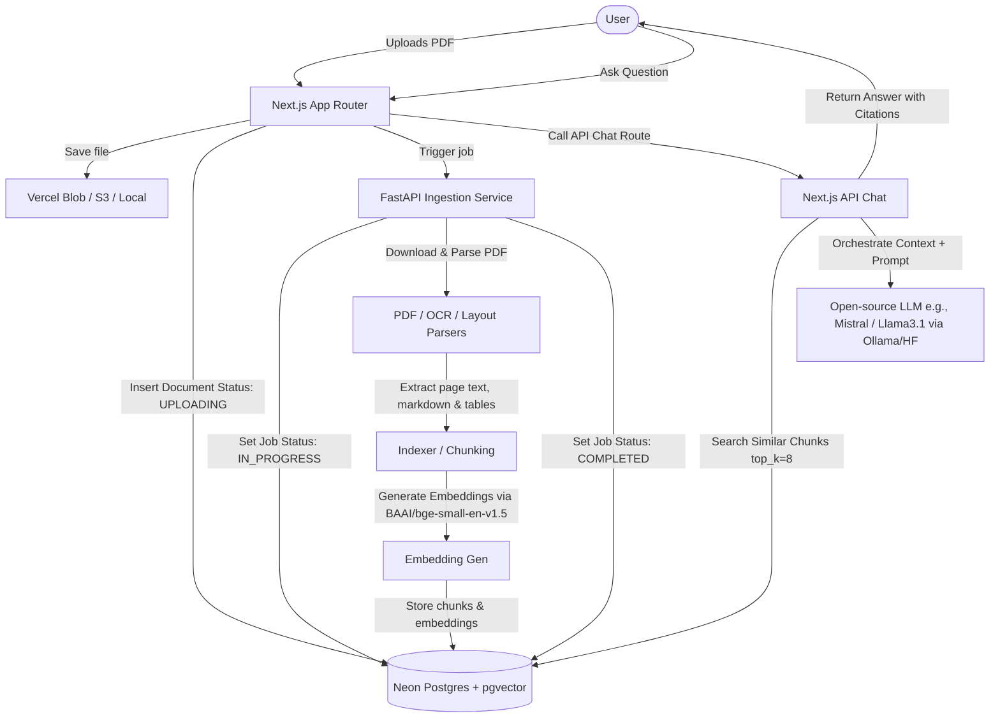

# Document RAG System Implementation Plan

This plan outlines the architecture, database schema, backend parser, RAG pipeline, and frontend components for the Document RAG System.

## Architecture & Workflow



## Proposed Changes

We will create a multi-project repository workspace containing:
1. `apps/web`: Next.js 15 frontend & orchestration API.
2. `services/ingestion`: FastAPI Python worker for ingestion, OCR, layout parsing, and indexer.
3. `prisma`: Prisma schemas and migrations.
4. `.github/workflows`: CI/CD workflows for linting, type-checking, building, and running tests.

---

### Database Schema (`prisma/schema.prisma`)

We will use Neon Postgres with the `pgvector` extension. The schema will define:
- `Document`: Represents the uploaded file.
- `DocumentPage`: Extracted text, markdown, and layout JSON for each page.
- `DocumentChunk`: Text chunks, metadata, and the 384-dimensional embeddings vector.
- `IngestionJob`: Tracking the status of parsing tasks.
- `ChatSession`: User chat threads.
- `ChatMessage`: Messages with user/assistant roles and structured citations (sources).

```prisma
datasource db {
  provider   = "postgresql"
  url        = env("DATABASE_URL")
  extensions = [pgvector(map: "vector")]
}

generator client {
  provider        = "prisma-client-js"
  previewFeatures = ["postgresqlExtensions"]
}

enum JobStatus {
  PENDING
  PROCESSING
  COMPLETED
  FAILED
}

model Document {
  id          String         @id @default(uuid()) @db.Uuid
  filename    String
  fileUrl     String         @map("file_url")
  status      JobStatus      @default(PENDING)
  createdAt   DateTime       @default(now()) @map("created_at")
  pages       DocumentPage[]
  chunks      DocumentChunk[]
  jobs        IngestionJob[]

  @@map("documents")
}

model DocumentPage {
  id          String   @id @default(uuid()) @db.Uuid
  documentId  String   @map("document_id") @db.Uuid
  pageNumber  Int      @map("page_number")
  rawText     String   @map("raw_text")
  markdown    String
  layoutJson  Json     @map("layout_json")
  document    Document @relation(fields: [documentId], references: [id], onDelete: Cascade)

  @@map("document_pages")
}

model DocumentChunk {
  id          String                      @id @default(uuid()) @db.Uuid
  documentId  String                      @map("document_id") @db.Uuid
  pageNumber  Int                         @map("page_number")
  chunkText   String                      @map("chunk_text")
  metadata    Json
  embedding   Unsupported("vector(384)")?
  document    Document                    @relation(fields: [documentId], references: [id], onDelete: Cascade)

  @@map("document_chunks")
}

model IngestionJob {
  id          String    @id @default(uuid()) @db.Uuid
  documentId  String    @map("document_id") @db.Uuid
  status      JobStatus @default(PENDING)
  error       String?
  createdAt   DateTime  @default(now()) @map("created_at")
  completedAt DateTime? @map("completed_at")
  document    Document  @relation(fields: [documentId], references: [id], onDelete: Cascade)

  @@map("ingestion_jobs")
}

model ChatSession {
  id        String        @id @default(uuid()) @db.Uuid
  createdAt DateTime      @default(now()) @map("created_at")
  messages  ChatMessage[]

  @@map("chat_sessions")
}

model ChatMessage {
  id        String      @id @default(uuid()) @db.Uuid
  sessionId String      @map("session_id") @db.Uuid
  role      String
  content   String
  sources   Json?
  createdAt DateTime    @default(now()) @map("created_at")
  session   ChatSession @relation(fields: [sessionId], references: [id], onDelete: Cascade)

  @@map("chat_messages")
}
```

---

### Ingestion Service (`services/ingestion`)

The ingestion service uses FastAPI. It downloads files, parses pages, extracts text/tables, chunks text, and stores them in Neon Postgres.
To handle missing binary dependencies on typical servers, the parsing services will use fallback logic:
- `pdf_parser.py`: Uses `pdfplumber` or `pypdf` for pure text extraction.
- `ocr_parser.py`: Uses `pytesseract` or `paddleocr` if available; otherwise falls back to pure text extraction or mock parsing for local testing.
- `layout_parser.py`: Performs layout structure extraction.
- `form_parser.py`: Parses forms and tables. Uses `camelot-py` or `pdfplumber`'s structured table extraction to find grid layouts, parses rows/columns, and formats them into Markdown tables. If `camelot` or system libraries are missing, it falls back to a regex/heuristics table extraction from plain text or mock table parsing. The parsed tables are embedded as structured Markdown tables into the page's markdown and chunk text, preserving structural tabular information for LLM querying.

### LlamaIndex & Vector Search Integration

We use LlamaIndex as the core framework for managing, indexing, and retrieving the document chunks:
1. **Embedding Model**: We configure LlamaIndex with `BAAI/bge-small-en-v1.5` embeddings (384 dimensions) using `llama-index-embeddings-huggingface` (or custom HuggingFace Inference API client) to match the `vector(384)` schema type in Postgres.
2. **Postgres Vector Store**: We use `llama-index-vector-stores-postgres` to connect LlamaIndex to the Neon Postgres database.
3. **Ingestion & Indexing (`rag/indexer.py`)**:
   - Page text, parsed tables, and metadata (e.g., `document_id`, `page_number`, `filename`) are mapped to LlamaIndex `TextNode` objects.
   - Text is chunked using LlamaIndex's `SentenceSplitter` (chunk size ~512 tokens, overlap ~50 tokens).
   - Node embeddings are generated and inserted directly into the `document_chunks` table via `PGVectorStore`.
4. **Retrieval (`rag/retriever.py`)**:
   - Uses `VectorStoreIndex` instantiated from the Postgres Vector Store.
   - We construct a `VectorDBRetriever` specifying `similarity_top_k=8` and dynamic metadata filtering (e.g., matching the specific `document_id`).
   - Retrieved nodes expose their metadata (`page_number`, text snippet, etc.) to compile precise source citations.

---

### Web App (`apps/web`)

Built using **Next.js 15**, **TypeScript**, and **Tailwind CSS**.
- **Page Layout**: Premium Dark Mode UI with Inter/Outfit font, smooth animations, and glassmorphism cards.
- **Upload Page** (`apps/web/app/upload/page.tsx`): Premium drag-and-drop file upload component. Connects to `api/upload` which stores files in Vercel Blob (or a local temp storage fallback) and kicks off FastAPI ingestion.
- **Chat Page** (`apps/web/app/chat/page.tsx`): Multimodal-feeling chat interface with a document selection dropdown, source citation cards, inline reference badges, and message formatting.
- **Document List Component**: A dashboard view displaying document processing statuses (`PENDING`, `PROCESSING`, `COMPLETED`, `FAILED`), page counts, and metadata.

---

## Verification Plan

### Automated Tests
- Python: Run `pytest` within `services/ingestion` (mocking database & embedding APIs to verify parsing logic).
- Next.js: Check type-safety using `npm run typecheck`, lint checks with `npm run lint`, and build validation with `npm run build`.

### Manual Verification
- Verify database migrations and schema creation on Neon Postgres.
- Test PDF upload flow and check that ingestion finishes.
- Verify similarity search retrieves page-specific chunks and formats citations properly.
